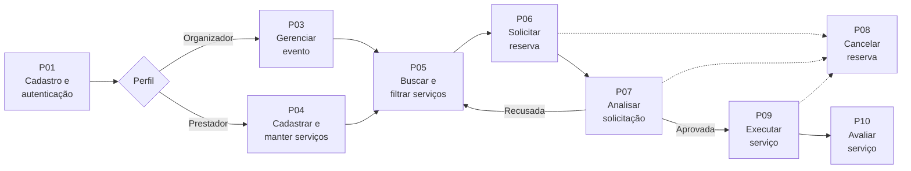
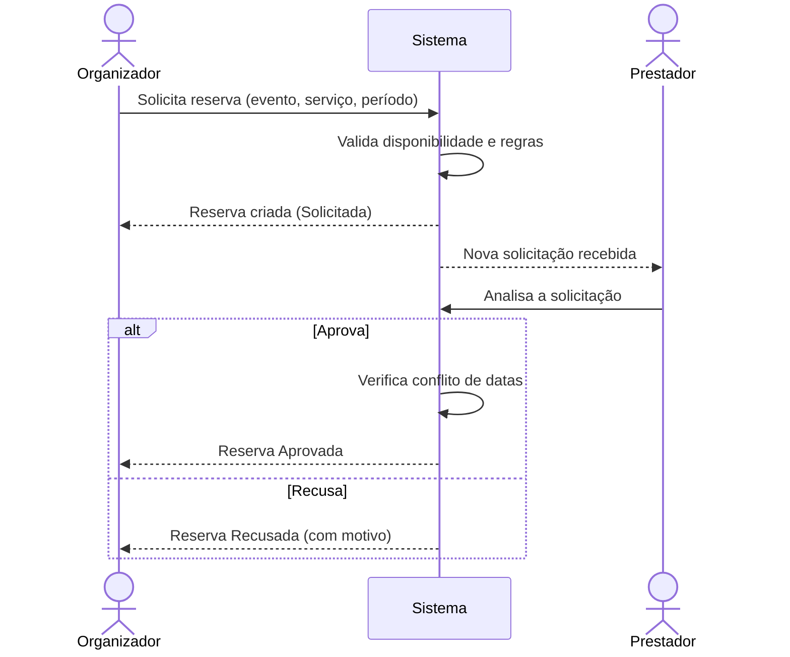
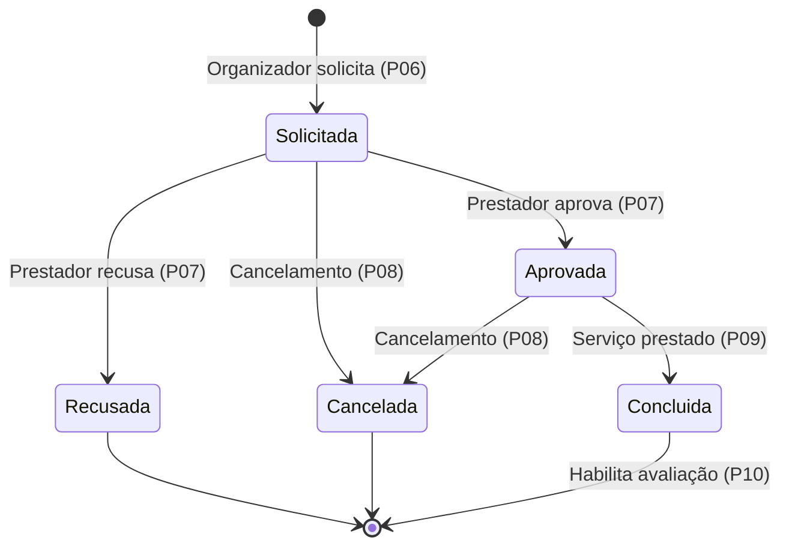

# 🔄 Processos — EventFy

> Descrição dos processos de negócio da plataforma EventFy, do cadastro do usuário à avaliação do serviço contratado.

---

## 1. Atores

| Ator | Papel nos processos |
|---|---|
| 🧑‍💼 **Organizador** | Cria eventos, busca serviços, solicita e acompanha reservas, avalia |
| 🏢 **Prestador** | Cadastra serviços, analisa e responde às solicitações |
| 🛡️ **Administrador** | Atividades administrativas (condicionado ao escopo final) |
| 🖥️ **Sistema** | Valida regras, registra estados, notifica *(proposta)* |

---

## 2. Visão Geral (macroprocesso)

| ID | Processo | Ator principal | Requisitos |
|---|---|---|---|
| P01 | Cadastro de usuário | Visitante | RF01, RN01 |
| P02 | Autenticação | Usuário | RF02, RF03, RF05 |
| P03 | Gerenciamento de eventos | Organizador | RF06–RF10 |
| P04 | Cadastro e manutenção de serviços | Prestador | RF11–RF14 |
| P05 | Busca e filtragem de serviços | Organizador | RF15–RF19 |
| P06 | Solicitação de reserva | Organizador | RF20, RF21 |
| P07 | Análise da solicitação | Prestador | RF22–RF24 |
| P08 | Cancelamento de reserva | Organizador / Prestador | RF25 |
| P09 | Acompanhamento e conclusão | Organizador / Prestador | RF10, RF21, RF26 |
| P10 | Avaliação do serviço | Organizador | RF28, RF29 |

---

## 3. Processos Detalhados

### P01 — Cadastro de usuário

| | |
|---|---|
| **Objetivo** | Criar uma conta para uso da plataforma |
| **Ator** | Visitante |
| **Gatilho** | O visitante escolhe "Cadastrar-se" |
| **Pré-condição** | Não possuir conta com o mesmo identificador (ex.: e-mail) |
| **Pós-condição** | Conta criada com perfil definido (organizador ou prestador) |
| **Requisitos** | RF01 · RN01 |

**Fluxo principal**

1. O visitante informa os dados de cadastro e escolhe o perfil de atuação.
2. O sistema valida os dados (campos obrigatórios, formato, unicidade).
3. O sistema cria a conta e confirma o cadastro.
4. O sistema direciona o usuário para a autenticação ou o inicia na sessão.

**Fluxos alternativos**

- **2a.** Dados inválidos ou incompletos → o sistema indica os erros e retorna ao passo 1.
- **2b.** Identificador já cadastrado → o sistema informa e sugere autenticação ou recuperação de senha.

---

### P02 — Autenticação

| | |
|---|---|
| **Objetivo** | Permitir o acesso às funcionalidades restritas |
| **Ator** | Organizador, Prestador, Administrador |
| **Gatilho** | O usuário escolhe "Entrar" |
| **Pré-condição** | Possuir conta cadastrada |
| **Pós-condição** | Sessão iniciada com permissões do perfil |
| **Requisitos** | RF02 · RF03 · RF05 · RN02 |

**Fluxo principal**

1. O usuário informa suas credenciais.
2. O sistema valida as credenciais.
3. O sistema inicia a sessão e apresenta a área correspondente ao perfil.

**Fluxos alternativos**

- **2a.** Credenciais inválidas → o sistema informa o erro sem indicar qual campo falhou *(proposta)* e permite nova tentativa.
- **1a.** Esqueceu a senha → executa a recuperação de senha *(proposta, RF05)*.
- **Encerramento:** a qualquer momento o usuário pode encerrar a sessão (RF03).

---

### P03 — Gerenciamento de eventos

| | |
|---|---|
| **Objetivo** | Criar e manter os eventos para os quais serão contratados serviços |
| **Ator** | Organizador |
| **Gatilho** | O organizador deseja planejar um evento |
| **Pré-condição** | Estar autenticado com perfil de organizador |
| **Pós-condição** | Evento criado, alterado ou cancelado |
| **Requisitos** | RF06–RF10 · RN03 · RN05 · RN15 |

**Fluxo principal — criar evento**

1. O organizador escolhe "Novo evento".
2. Informa os dados do evento (ex.: nome, data/período, local, descrição).
3. O sistema valida e salva o evento.
4. O evento passa a constar na lista de eventos do organizador, sem serviços associados.

**Fluxos alternativos**

- **Editar evento:** o organizador seleciona um evento, altera os dados e o sistema valida e salva. Se a data mudar e houver reservas ativas, o sistema alerta sobre o impacto *(proposta)*.
- **Consultar evento:** o sistema exibe os dados e os serviços associados com o estado de cada reserva (RF10).
- **Excluir/cancelar evento:** o sistema solicita confirmação, cancela as reservas ativas associadas (RN15) e marca o evento como cancelado ou excluído.
- **3a.** Dados inválidos → o sistema indica os erros e retorna ao passo 2.

---

### P04 — Cadastro e manutenção de serviços

| | |
|---|---|
| **Objetivo** | Disponibilizar serviços ou estruturas no catálogo |
| **Ator** | Prestador |
| **Gatilho** | O prestador deseja ofertar ou atualizar um serviço |
| **Pré-condição** | Estar autenticado com perfil de prestador |
| **Pós-condição** | Serviço publicado, atualizado ou desativado |
| **Requisitos** | RF11–RF14 · RN04 · RN05 · RN14 |

**Fluxo principal — cadastrar serviço**

1. O prestador escolhe "Novo serviço".
2. Informa os dados (ex.: nome, categoria, descrição, preço ou faixa, localização de atuação).
3. Informa a disponibilidade (datas) *(proposta)*.
4. O sistema valida e publica o serviço no catálogo.

**Fluxos alternativos**

- **Editar serviço:** o prestador altera os dados; o sistema valida e atualiza o catálogo.
- **Atualizar disponibilidade:** o prestador bloqueia ou libera datas *(proposta)*.
- **Desativar serviço:** o serviço deixa de aparecer no catálogo e de receber solicitações, preservando o histórico (RN14).
- **4a.** Dados inválidos → o sistema indica os erros e retorna ao passo 2.

---

### P05 — Busca e filtragem de serviços

| | |
|---|---|
| **Objetivo** | Localizar e comparar serviços adequados ao evento |
| **Ator** | Organizador (visitante, se o catálogo for público) |
| **Gatilho** | O organizador precisa de um serviço para o evento |
| **Pré-condição** | Existirem serviços ativos no catálogo |
| **Pós-condição** | Serviço de interesse identificado |
| **Requisitos** | RF15–RF19 |

**Fluxo principal**

1. O organizador acessa o catálogo.
2. Informa um termo de busca e/ou aplica filtros (ex.: categoria, preço, localização, disponibilidade na data do evento).
3. O sistema apresenta a lista de resultados.
4. O organizador abre o detalhe de um serviço (RF16).
5. Opcionalmente, compara serviços lado a lado *(proposta, RF19)*.
6. O organizador segue para a solicitação de reserva (P06).

**Fluxos alternativos**

- **3a.** Nenhum resultado → o sistema informa e sugere ampliar ou remover filtros.

---

### P06 — Solicitação de reserva

| | |
|---|---|
| **Objetivo** | Solicitar um serviço para um evento e período |
| **Ator** | Organizador |
| **Gatilho** | O organizador decide contratar um serviço |
| **Pré-condição** | Estar autenticado; possuir evento criado; serviço ativo |
| **Pós-condição** | Reserva criada no estado **Solicitada** |
| **Requisitos** | RF20 · RF21 · RN03 · RN06 · RN08 · RN10 |

**Fluxo principal**

1. A partir do detalhe do serviço, o organizador escolhe "Solicitar reserva".
2. Seleciona o evento e informa o período desejado.
3. O sistema verifica a disponibilidade e a consistência do período com o evento (RN10).
4. O organizador revisa e confirma a solicitação.
5. O sistema cria a reserva no estado **Solicitada** e a associa ao evento, ao serviço e ao período (RN06).
6. O sistema disponibiliza a solicitação ao prestador e notifica-o *(proposta)*.

**Fluxos alternativos**

- **3a.** Serviço indisponível no período → o sistema informa e permite escolher outro período ou serviço.
- **3b.** Período fora do evento → o sistema informa e solicita correção.
- **2a.** Organizador sem evento → o sistema oferece a criação de um evento (P03).

---

### P07 — Análise da solicitação

| | |
|---|---|
| **Objetivo** | Permitir que o prestador aprove ou recuse a solicitação |
| **Ator** | Prestador |
| **Gatilho** | Chegada de uma solicitação no estado **Solicitada** |
| **Pré-condição** | Ser o prestador titular do serviço (RN07) |
| **Pós-condição** | Reserva **Aprovada** ou **Recusada** |
| **Requisitos** | RF22–RF24 · RN07 · RN09 · RN11 |

**Fluxo principal**

1. O prestador acessa a lista de solicitações recebidas.
2. Abre uma solicitação e consulta evento, período e dados do organizador.
3. Decide **aprovar**.
4. O sistema verifica conflito de datas (RN09).
5. O sistema muda a reserva para **Aprovada**, bloqueia o período na disponibilidade *(proposta)* e notifica o organizador.

**Fluxos alternativos**

- **3a. Recusar:** o prestador (opcionalmente) informa o motivo; o sistema muda a reserva para **Recusada**, registra data/hora (RN11) e notifica o organizador. O organizador pode buscar outro serviço (P05).
- **4a. Conflito de datas:** o sistema impede a aprovação e informa o prestador.

---

### P08 — Cancelamento de reserva

| | |
|---|---|
| **Objetivo** | Encerrar uma reserva antes da execução do serviço |
| **Ator** | Organizador ou Prestador |
| **Gatilho** | Uma das partes não pode ou não deseja manter a reserva |
| **Pré-condição** | Reserva em estado **Solicitada** ou **Aprovada** e dentro das regras de cancelamento (RN12) |
| **Pós-condição** | Reserva no estado **Cancelada** |
| **Requisitos** | RF25 · RN11 · RN12 · RN15 |

**Fluxo principal**

1. O usuário abre a reserva e escolhe "Cancelar".
2. O sistema verifica se o cancelamento é permitido (prazo e estado, conforme RN12).
3. O usuário confirma e, se solicitado, informa o motivo.
4. O sistema muda a reserva para **Cancelada**, libera o período na disponibilidade *(proposta)* e notifica a outra parte.

**Fluxos alternativos**

- **2a.** Cancelamento não permitido pelas regras → o sistema informa o motivo.
- **Cancelamento em cascata:** ao cancelar um evento (P03), as reservas ativas são canceladas automaticamente (RN15).

> ⚠️ As regras de prazo e de quem pode cancelar em cada estado **ainda não estão definidas** no README (ver pontos em aberto).

---

### P09 — Acompanhamento e conclusão da reserva

| | |
|---|---|
| **Objetivo** | Permitir o acompanhamento do estado das reservas e registrar a conclusão do serviço |
| **Ator** | Organizador, Prestador |
| **Gatilho** | Consulta ao evento/reservas ou término do período reservado |
| **Pré-condição** | Existir ao menos uma reserva |
| **Pós-condição** | Estado da reserva consultado; reservas **Aprovadas** encerradas como **Concluídas** |
| **Requisitos** | RF10 · RF21 · RF22 · RF26 |

**Fluxo principal**

1. O organizador consulta seus eventos e vê os serviços associados e o estado de cada reserva; o prestador consulta as reservas de seus serviços.
2. Ao término do período de uma reserva **Aprovada**, ela passa a **Concluída** *(proposta: automaticamente ou por confirmação de uma das partes; a definir)*.
3. O sistema registra o histórico de mudanças de estado *(proposta, RF26)*.

---

### P10 — Avaliação do serviço *(caso permaneça no escopo)*

| | |
|---|---|
| **Objetivo** | Registrar a opinião do organizador sobre o serviço contratado |
| **Ator** | Organizador |
| **Gatilho** | Reserva no estado **Concluída** |
| **Pré-condição** | O organizador contratou o serviço e ainda não o avaliou (RN13) |
| **Pós-condição** | Avaliação registrada e exibida no serviço |
| **Requisitos** | RF28 · RF29 · RN13 |

**Fluxo principal**

1. O organizador acessa a reserva concluída e escolhe "Avaliar".
2. Informa a avaliação (ex.: nota e comentário).
3. O sistema valida e registra a avaliação.
4. A avaliação passa a ser exibida no detalhe do serviço (RF29).

**Fluxos alternativos**

- **1a.** Reserva ainda não concluída, ou já avaliada → o sistema impede a avaliação.

---

## 4. Máquina de Estados da Reserva *(proposta)*

| Estado | Quem provoca a mudança | Efeito |
|---|---|---|
| Solicitada | Organizador | Pedido aguarda análise |
| Aprovada | Prestador | Período reservado |
| Recusada | Prestador | Encerra o pedido |
| Cancelada | Organizador ou Prestador | Encerra e libera o período |
| Concluída | Sistema / partes *(a definir)* | Habilita a avaliação |

---

## 5. Matriz Processo × Perfil

| Processo | Visitante | Organizador | Prestador | Administrador |
|---|:---:|:---:|:---:|:---:|
| P01 Cadastro | ✅ | | | |
| P02 Autenticação | | ✅ | ✅ | ✅ |
| P03 Eventos | | ✅ | | |
| P04 Serviços | | | ✅ | ✅ *(moderação)* |
| P05 Busca e filtragem | ❓ | ✅ | ✅ | ✅ |
| P06 Solicitar reserva | | ✅ | | |
| P07 Analisar solicitação | | | ✅ | |
| P08 Cancelar reserva | | ✅ | ✅ | ✅ |
| P09 Acompanhar/concluir | | ✅ | ✅ | ✅ |
| P10 Avaliar | | ✅ | | |

❓ = depende da decisão sobre catálogo público.

