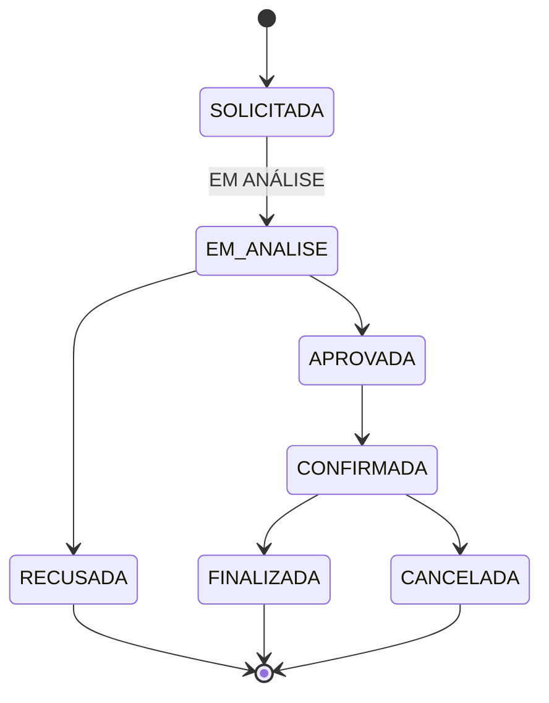

# REQUISITOS — EventFy

> Documento de especificação de requisitos funcionais, não funcionais, regras de negócio e rastreabilidade do sistema **EventFy**.

## Sumário

- [1. Requisitos Funcionais](#1-requisitos-funcionais)
- [2. Requisitos Não Funcionais](#2-requisitos-não-funcionais)
- [3. Regras de Negócio](#3-regras-de-negócio)
- [4. Matriz de rastreabilidade](#4-matriz-de-rastreabilidade)
- [5. Dependências e decisões pendentes](#5-dependências-e-decisões-pendentes)
- [6. Convenções de especificação](#6-convenções-de-especificação)

---

## 1. Requisitos Funcionais

### RF01 — Cadastro de usuário

O sistema deverá permitir o cadastro de usuários informando, no mínimo, nome, e-mail, senha e tipo de usuário.

O e-mail informado deverá ser único no sistema.

O cadastro deverá ser recusado quando já existir um usuário com o e-mail informado.

**Critérios de aceitação**

- **CA01.1:** Dado que o usuário informe todos os campos obrigatórios com valores válidos, quando confirmar o cadastro, então o sistema deverá criar a conta.
- **CA01.2:** Dado que o e-mail informado já esteja cadastrado, quando o usuário tentar concluir o cadastro, então o sistema deverá impedir a criação da conta.
- **CA01.3:** Dado que exista algum campo obrigatório inválido ou ausente, quando o usuário tentar concluir o cadastro, então o sistema deverá informar o campo que precisa ser corrigido.
- **CA01.4:** O sistema deverá armazenar o usuário com um identificador único.

---

### RF02 — Autenticação

O sistema deverá permitir que usuários cadastrados realizem autenticação utilizando suas credenciais.

O sistema deverá permitir que o usuário encerre sua sessão por meio da funcionalidade de logout.

**Critérios de aceitação**

- **CA02.1:** Dado que o usuário informe credenciais válidas, quando realizar a autenticação, então o sistema deverá permitir o acesso à área correspondente ao seu tipo de usuário.
- **CA02.2:** Dado que as credenciais informadas sejam inválidas, quando o usuário tentar realizar a autenticação, então o sistema deverá impedir o acesso e informar que as credenciais não são válidas.
- **CA02.3:** Dado que o usuário esteja autenticado, quando realizar logout, então o sistema deverá encerrar sua sessão.
- **CA02.4:** Após o logout, o usuário não deverá acessar funcionalidades que exijam autenticação sem realizar uma nova autenticação.

---

### RF03 — Gerenciamento de perfil

O sistema deverá permitir que um usuário autenticado consulte e atualize as informações de seu perfil que forem disponibilizadas para edição.

O tipo de usuário não deverá ser alterado pelo próprio usuário caso essa alteração permita modificar suas permissões no sistema.

**Critérios de aceitação**

- **CA03.1:** Dado que o usuário esteja autenticado, quando acessar seu perfil, então o sistema deverá apresentar suas informações cadastradas.
- **CA03.2:** Dado que o usuário altere informações permitidas, quando salvar as alterações, então o sistema deverá atualizar seus dados.
- **CA03.3:** O sistema deverá impedir a alteração de informações que não estejam disponíveis para edição pelo usuário.

---

### RF04 — Cadastro de serviço

O sistema deverá permitir que um prestador ou fornecedor autenticado cadastre um serviço.

O serviço deverá possuir as informações definidas pelo domínio do EventFy, incluindo, no mínimo, nome, descrição, categoria, preço e informações de disponibilidade.

**Critérios de aceitação**

- **CA04.1:** Dado que o usuário esteja autenticado como prestador ou fornecedor, quando informar os dados obrigatórios de um serviço e confirmar o cadastro, então o sistema deverá criar o serviço.
- **CA04.2:** Dado que o usuário não possua permissão para cadastrar serviços, quando tentar realizar o cadastro, então o sistema deverá impedir a operação.
- **CA04.3:** Dado que algum campo obrigatório esteja ausente ou inválido, quando o usuário tentar cadastrar o serviço, então o sistema deverá informar o erro.
- **CA04.4:** O serviço deverá ser associado ao usuário responsável por sua disponibilização.

---

### RF05 — Consulta de serviços

O sistema deverá permitir que usuários consultem os serviços disponíveis no catálogo.

A consulta deverá apresentar as informações necessárias para que o usuário identifique o serviço e decida se deseja visualizar seus detalhes.

**Critérios de aceitação**

- **CA05.1:** Quando o usuário acessar o catálogo, então o sistema deverá apresentar os serviços disponíveis.
- **CA05.2:** Cada serviço apresentado deverá possuir informações suficientes para sua identificação.
- **CA05.3:** Serviços desativados não deverão ser apresentados como disponíveis para novas solicitações.

---

### RF06 — Busca e filtragem de serviços

O sistema deverá permitir a busca e a filtragem dos serviços utilizando os critérios definidos para o catálogo.

**Critérios de aceitação**

- **CA06.1:** Quando o usuário informar um termo de busca válido, então o sistema deverá apresentar os serviços compatíveis com o termo.
- **CA06.2:** Quando o usuário aplicar um filtro, então o sistema deverá apresentar somente os serviços compatíveis com o filtro.
- **CA06.3:** Quando nenhum serviço atender aos critérios informados, então o sistema deverá informar que não foram encontrados serviços correspondentes.

---

### RF07 — Visualização de detalhes do serviço

O sistema deverá permitir que o usuário visualize os detalhes de um serviço selecionado no catálogo.

Os detalhes deverão incluir as informações necessárias para que o organizador avalie a possibilidade de solicitar o serviço.

**Critérios de aceitação**

- **CA07.1:** Quando o usuário selecionar um serviço existente, então o sistema deverá apresentar seus detalhes.
- **CA07.2:** As informações apresentadas deverão corresponder ao serviço selecionado.
- **CA07.3:** O sistema deverá disponibilizar a opção de solicitar o serviço quando o usuário possuir permissão e o serviço estiver disponível para novas solicitações.

---

### RF08 — Gerenciamento de serviço

O sistema deverá permitir que o prestador ou fornecedor responsável consulte e atualize as informações dos serviços que cadastrou.

O sistema deverá permitir a desativação de um serviço sem eliminar o histórico relacionado a reservas já realizadas.

**Critérios de aceitação**

- **CA08.1:** Dado que o usuário seja responsável pelo serviço, quando acessar seu gerenciamento, então o sistema deverá permitir a consulta de suas informações.
- **CA08.2:** Dado que o usuário seja responsável pelo serviço, quando alterar informações permitidas e salvar, então o sistema deverá atualizar o serviço.
- **CA08.3:** Dado que o serviço possua histórico de reservas, quando o responsável solicitar sua desativação, então o sistema deverá preservar as informações históricas.
- **CA08.4:** Um serviço desativado não deverá receber novas solicitações de reserva.

---

### RF09 — Criação de evento

O sistema deverá permitir que um organizador autenticado cadastre um evento para o qual pretende solicitar serviços.

O evento deverá possuir, no mínimo, nome, descrição, data de início, data de término e local.

**Critérios de aceitação**

- **CA09.1:** Dado que o usuário esteja autenticado como organizador, quando informar os dados obrigatórios e confirmar o cadastro, então o sistema deverá criar o evento.
- **CA09.2:** O evento deverá ser associado ao organizador responsável.
- **CA09.3:** O sistema deverá impedir o cadastro quando os dados obrigatórios forem inválidos ou estiverem ausentes.
- **CA09.4:** A data de início não poderá ser posterior à data de término.

---

### RF10 — Solicitação de reserva

O sistema deverá permitir que um organizador solicite a reserva de um serviço para um evento.

A solicitação deverá registrar o evento, o serviço, o período solicitado e as demais informações necessárias para o processamento da reserva.

Uma nova solicitação deverá iniciar no estado `SOLICITADA`.

**Critérios de aceitação**

- **CA10.1:** Dado que o usuário seja um organizador autenticado e possua um evento, quando solicitar um serviço para esse evento e informar um período válido, então o sistema deverá registrar a solicitação.
- **CA10.2:** Uma nova solicitação deverá possuir o estado `SOLICITADA`.
- **CA10.3:** A solicitação deverá identificar o organizador, o evento e o serviço envolvidos.
- **CA10.4:** O sistema deverá impedir a criação de uma solicitação quando os dados obrigatórios forem inválidos.
- **CA10.5:** O sistema deverá verificar as regras de disponibilidade aplicáveis ao serviço antes de permitir o processamento da solicitação.

---

### RF11 — Análise de solicitação

O sistema deverá permitir que o prestador ou fornecedor responsável analise uma solicitação de reserva relacionada a um de seus serviços.

A solicitação deverá passar para o estado `EM ANÁLISE` quando o prestador iniciar sua análise.

**Critérios de aceitação**

- **CA11.1:** Dado que exista uma reserva no estado `SOLICITADA`, quando o prestador responsável iniciar a análise, então o sistema deverá alterar seu estado para `EM ANÁLISE`.
- **CA11.2:** Somente o responsável pelo serviço poderá realizar a análise da solicitação.
- **CA11.3:** Uma solicitação que não esteja em estado `SOLICITADA` não deverá ser iniciada novamente como uma nova análise.

---

### RF12 — Aprovação ou recusa de solicitação

O sistema deverá permitir que o prestador ou fornecedor responsável aprove ou recuse uma solicitação que esteja em análise.

Quando a solicitação for aprovada, seu estado deverá ser alterado para `APROVADA`.

Quando a solicitação for recusada, seu estado deverá ser alterado para `RECUSADA` e deverá ser registrado um motivo para a recusa.

**Critérios de aceitação**

- **CA12.1:** Dado que uma reserva esteja no estado `EM ANÁLISE`, quando o responsável aprová-la, então o sistema deverá alterar seu estado para `APROVADA`.
- **CA12.2:** Dado que uma reserva esteja no estado `EM ANÁLISE`, quando o responsável solicitar sua recusa, então o sistema deverá exigir um motivo.
- **CA12.3:** O sistema não deverá permitir a recusa sem motivo.
- **CA12.4:** Após a recusa, o sistema deverá registrar o motivo informado.
- **CA12.5:** Uma reserva recusada deverá possuir o estado `RECUSADA`.

---

### RF13 — Confirmação de reserva

O sistema deverá permitir que o organizador confirme uma reserva aprovada.

Quando a confirmação for realizada, a reserva deverá passar para o estado `CONFIRMADA`.

**Critérios de aceitação**

- **CA13.1:** Dado que uma reserva esteja no estado `APROVADA`, quando o organizador responsável confirmá-la, então o sistema deverá alterar seu estado para `CONFIRMADA`.
- **CA13.2:** Somente o organizador responsável pela reserva poderá realizar a confirmação.
- **CA13.3:** Uma reserva que não esteja no estado `APROVADA` não deverá ser confirmada por essa operação.

---

### RF14 — Cancelamento de reserva

O sistema deverá permitir o cancelamento de uma reserva de acordo com as regras de negócio definidas para o estado atual da reserva e para o usuário responsável pela operação.

O cancelamento deverá preservar o registro da reserva e seu histórico.

**Critérios de aceitação**

- **CA14.1:** Dado que uma reserva esteja em um estado que permita cancelamento, quando um usuário autorizado solicitar o cancelamento, então o sistema deverá alterar seu estado para `CANCELADA`.
- **CA14.2:** O sistema deverá impedir o cancelamento quando o usuário não possuir permissão para realizar a operação.
- **CA14.3:** O cancelamento não deverá excluir fisicamente a reserva.
- **CA14.4:** O sistema deverá registrar a alteração de estado no histórico da reserva quando o mecanismo de histórico estiver implementado.

> **⚠️ Ponto a definir:** as condições específicas de cancelamento por organizador e prestador/fornecedor deverão ser fechadas pela equipe antes da implementação.

---

### RF15 — Gerenciamento de eventos

O sistema deverá permitir que o organizador consulte e gerencie os eventos de sua responsabilidade.

**Critérios de aceitação**

- **CA15.1:** Dado que o usuário esteja autenticado como organizador, quando acessar seus eventos, então o sistema deverá apresentar somente os eventos sob sua responsabilidade.
- **CA15.2:** O organizador deverá poder consultar os dados de um evento.
- **CA15.3:** O sistema deverá preservar a associação entre o evento e seu organizador.
- **CA15.4:** As alterações realizadas no evento deverão respeitar as regras de negócio relacionadas às reservas existentes.

---

### RF16 — Acompanhamento de reservas

O sistema deverá permitir que os usuários envolvidos em uma reserva acompanhem seu estado atual e as informações relacionadas à solicitação.

**Critérios de aceitação**

- **CA16.1:** O organizador deverá conseguir consultar as reservas relacionadas aos seus eventos.
- **CA16.2:** O prestador ou fornecedor deverá conseguir consultar as reservas relacionadas aos seus serviços.
- **CA16.3:** O sistema deverá apresentar o estado atual da reserva.
- **CA16.4:** O sistema deverá apresentar as informações necessárias para identificar a reserva, o evento e o serviço relacionado.
- **CA16.5:** Quando o histórico de estados estiver implementado, o sistema deverá permitir sua consulta aos usuários autorizados.

---

### RF17 — Avaliação de serviço

O sistema deverá permitir que o organizador avalie um serviço após a conclusão da contratação, caso a funcionalidade de avaliação permaneça no escopo da versão.

A avaliação deverá estar vinculada à contratação correspondente.

**Critérios de aceitação**

- **CA17.1:** Dado que uma reserva esteja no estado `FINALIZADA`, quando o organizador responsável acessar a funcionalidade de avaliação, então o sistema deverá permitir o registro da avaliação.
- **CA17.2:** O sistema deverá associar a avaliação à reserva e ao serviço correspondente.
- **CA17.3:** O sistema não deverá permitir que uma reserva não finalizada seja avaliada.
- **CA17.4:** O usuário não deverá avaliar uma contratação que não seja de sua responsabilidade.

---

### RF18 — Visualização do histórico de reserva

O sistema deverá permitir a manutenção das informações necessárias para identificar as alterações de estado de uma reserva.

Cada alteração de estado deverá registrar, quando o mecanismo de histórico estiver implementado:

- reserva relacionada;
- estado anterior;
- novo estado;
- data e hora da alteração;
- usuário responsável pela alteração;
- observação ou motivo, quando aplicável.

**Critérios de aceitação**

- **CA18.1:** Quando uma reserva tiver seu estado alterado, o sistema deverá registrar a alteração.
- **CA18.2:** O registro deverá identificar o estado anterior e o novo estado.
- **CA18.3:** O registro deverá possuir data e hora da alteração.
- **CA18.4:** O registro deverá identificar o usuário responsável pela alteração quando a operação for realizada por um usuário.
- **CA18.5:** O histórico deverá preservar as alterações realizadas na reserva.

---

## 2. Requisitos Não Funcionais

### RNF01 — Segurança de credenciais

As credenciais dos usuários deverão ser armazenadas de forma segura, utilizando mecanismo de proteção adequado para senhas.

O sistema não deverá armazenar senhas em texto puro.

**Critério de aceitação**

- **CA-RNF01.1:** Ao consultar os dados persistidos de um usuário, a senha não deverá estar armazenada em texto puro.

---

### RNF02 — Integridade das reservas

O sistema deverá impedir que uma reserva seja confirmada quando houver conflito com uma reserva incompatível para o mesmo serviço e período, de acordo com as regras de disponibilidade definidas.

**Critério de aceitação**

- **CA-RNF02.1:** Dado que exista uma reserva incompatível para determinado serviço e período, quando uma nova reserva for submetida à confirmação, então o sistema deverá impedir a confirmação e informar o conflito.

---

### RNF03 — Usabilidade

As funcionalidades principais deverão apresentar navegação consistente e informações suficientes para que o usuário compreenda a ação disponível em cada etapa.

As mensagens de erro deverão identificar o problema e orientar o usuário sobre a ação necessária.

**Critérios de aceitação**

- **CA-RNF03.1:** As telas principais deverão possuir mecanismo de navegação consistente.
- **CA-RNF03.2:** Mensagens de erro deverão identificar o campo ou operação que precisa ser corrigido quando essa informação estiver disponível.
- **CA-RNF03.3:** As ações relacionadas ao fluxo de reserva deverão apresentar claramente o estado atual da reserva.

---

### RNF04 — Identificação única

Cada entidade persistida deverá possuir um identificador único.

O identificador não deverá ser reutilizado para representar outro registro após a remoção lógica ou exclusão do registro.

**Critério de aceitação**

- **CA-RNF04.1:** Não deverá existir mais de um registro persistido com o mesmo identificador dentro da mesma entidade.

---

### RNF05 — Rastreabilidade de reservas

O sistema deverá preservar informações suficientes para rastrear as alterações realizadas nas reservas.

O histórico deverá permitir identificar, quando aplicável, o estado anterior, o novo estado, a data e hora da alteração e o usuário responsável.

**Critérios de aceitação**

- **CA-RNF05.1:** Uma alteração de estado deverá gerar um registro no histórico.
- **CA-RNF05.2:** O histórico deverá permitir reconstruir a sequência de estados pela qual a reserva passou.

---

### RNF06 — Consistência dos dados

O sistema deverá manter a consistência das informações relacionadas entre usuários, eventos, serviços, reservas e avaliações.

As restrições de integridade definidas no modelo de dados deverão ser respeitadas.

**Critérios de aceitação**

- **CA-RNF06.1:** Uma reserva deverá referenciar um usuário, um evento e um serviço existentes.
- **CA-RNF06.2:** O sistema não deverá permitir referências para registros inexistentes.
- **CA-RNF06.3:** Uma avaliação deverá estar vinculada a uma contratação válida quando essa funcionalidade estiver habilitada.

---

## 3. Regras de Negócio

### RN01 — Responsabilidade sobre eventos

Um evento deverá possuir um único organizador responsável.

O organizador somente poderá gerenciar os eventos sob sua responsabilidade.

---

### RN02 — Responsabilidade sobre serviços

Um serviço deverá possuir um prestador ou fornecedor responsável.

Somente o responsável pelo serviço poderá gerenciar suas informações e analisar solicitações relacionadas ao serviço.

---

### RN03 — Responsabilidade sobre reservas

Uma reserva deverá relacionar:

- um organizador;
- um evento;
- um serviço;
- o prestador ou fornecedor responsável pelo serviço;
- um período de solicitação;
- um estado.

---

### RN04 — Motivo de recusa

Toda reserva recusada deverá possuir um motivo registrado.

O sistema não deverá permitir que uma reserva seja alterada para `RECUSADA` sem que o motivo seja informado.

---

### RN05 — Estados válidos da reserva

Uma reserva deverá obedecer às transições de estado definidas pelo sistema. As transições atualmente previstas são:

Uma reserva não deverá realizar uma transição que não esteja prevista nas regras do sistema.

---

### RN06 — Disponibilidade do serviço

Um serviço somente poderá ser confirmado para um período compatível com sua disponibilidade.

O sistema deverá impedir conflitos entre reservas que não possam ocorrer simultaneamente para o mesmo serviço.

A forma de representação da disponibilidade deverá ser definida no modelo de domínio e no modelo de dados.

---

### RN07 — Histórico da reserva

As alterações de estado de uma reserva deverão ser preservadas para permitir sua rastreabilidade.

O histórico deverá manter, no mínimo:

- estado anterior;
- novo estado;
- data e hora;
- usuário responsável pela alteração, quando aplicável.

---

## 4. Matriz de rastreabilidade

| Requisito | Regra de negócio | Entidade principal | Protótipo/fluxo |
|---|---|---|---|
| RF01 | — | `Usuario` | Cadastro |
| RF02 | — | `Usuario` | Autenticação |
| RF03 | RN01/RN02 | `Usuario` | Perfil |
| RF04 | RN02 | `Servico` | Cadastro de serviço |
| RF05 | RN02 | `Servico` | Catálogo |
| RF06 | RN02 | `Servico` | Busca e filtros |
| RF07 | RN02 | `Servico` | Detalhes do serviço |
| RF08 | RN02 | `Servico` | Gerenciamento de serviço |
| RF09 | RN01 | `Evento` | Cadastro de evento |
| RF10 | RN01/RN03/RN06 | `Reserva` | Solicitação |
| RF11 | RN02/RN05 | `Reserva` | Análise |
| RF12 | RN02/RN04/RN05 | `Reserva` | Aprovação/recusa |
| RF13 | RN01/RN05 | `Reserva` | Confirmação |
| RF14 | RN05/RN07 | `Reserva` | Cancelamento |
| RF15 | RN01 | `Evento` | Gerenciamento de eventos |
| RF16 | RN03/RN05/RN07 | `Reserva` | Acompanhamento |
| RF17 | RN01 | `Avaliacao` | Avaliação |
| RF18 | RN07 | `Reserva` | Histórico |
| RNF01 | — | `Usuario` | Autenticação |
| RNF02 | RN06 | `Reserva` | Confirmação |
| RNF03 | — | Interface | Todos os fluxos |
| RNF04 | — | Todas | Persistência |
| RNF05 | RN07 | `Reserva` | Histórico |
| RNF06 | RN01/RN02/RN03 | Todas | Persistência |

---

## 5. Dependências e decisões pendentes

Os seguintes pontos deverão ser definidos antes da implementação das funcionalidades correspondentes:

| ID | Questão | Artefato afetado |
|---|---|---|
| DP01 | Tipos definitivos de usuário e respectivas permissões | Requisitos, domínio e dados |
| DP02 | Representação detalhada da disponibilidade dos serviços | Requisitos, domínio e dados |
| DP03 | Condições específicas para cancelamento | Requisitos e estados |
| DP04 | Necessidade e permissões do perfil administrador | Requisitos e domínio |
| DP05 | Formato e conteúdo da avaliação | Requisitos, domínio e dados |
| DP06 | Forma definitiva de armazenamento do histórico da reserva | Requisitos, domínio e dados |
| DP07 | Regras para alteração de eventos que possuam reservas | Requisitos e domínio |
| DP08 | Regras para alteração de serviços que possuam reservas | Requisitos e domínio |

Essas decisões deverão ser registradas antes de serem incorporadas aos demais artefatos.

---

## 6. Convenções de especificação

Os requisitos deverão:

- possuir identificador único;
- descrever uma necessidade ou comportamento específico;
- utilizar linguagem objetiva;
- evitar termos subjetivos ou ambíguos;
- utilizar `deverá` para requisitos obrigatórios;
- possuir critérios de aceitação quando aplicável;
- possuir rastreabilidade com regras e modelos relacionados;
- ser verificáveis por meio de critérios objetivos.

Termos como "rapidamente", "adequadamente", "fácil", "intuitivo" e "etc." deverão ser evitados quando não houver uma definição objetiva associada.

Alterações nos requisitos deverão ser refletidas nos artefatos dependentes.
