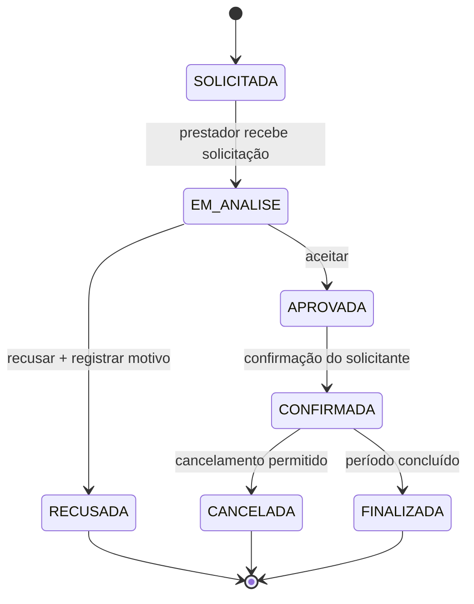

# Diagrama de estados — Reserva

A `Reserva` é o objeto central escolhido para o diagrama de estados porque representa o fluxo principal de contratação.

## Regras

1. Toda solicitação começa como `SOLICITADA`.
2. O prestador/fornecedor analisa a solicitação.
3. Uma solicitação pode ser aceita ou recusada.
4. Uma recusa exige motivo.
5. Uma solicitação aceita pode ser confirmada.
6. Uma reserva confirmada pode ser finalizada após o período.
7. Uma reserva confirmada pode ser cancelada conforme as regras de negócio.
