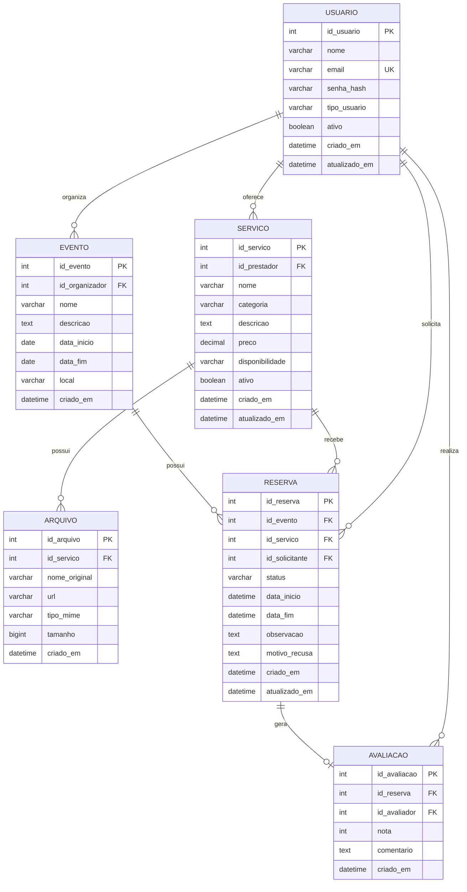

# Modelo de dados — EventFy

## Observações

- As chaves primárias garantem identidade técnica.
- `USUARIO.email` deve possuir restrição de unicidade.
- `RESERVA.status` representa o ciclo de vida definido no diagrama de estados.
- `RESERVA.motivo_recusa` é preenchido quando o estado for `RECUSADA`.
- `ARQUIVO.url` referencia o armazenamento do arquivo.
