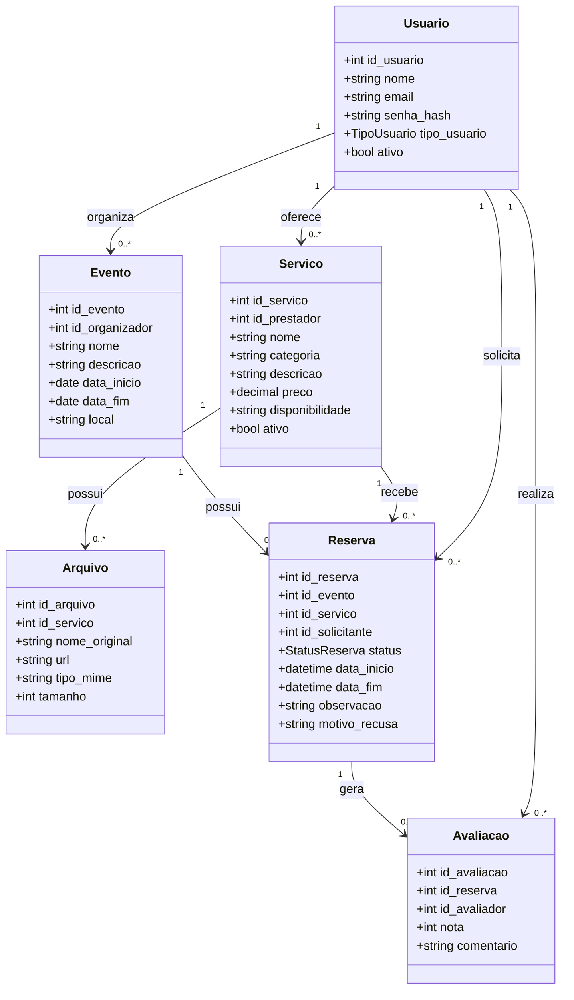

# Modelo de domínio — EventFy

O modelo de domínio abaixo relaciona as principais entidades do EventFy e os requisitos que justificam suas responsabilidades.

## Rastreabilidade

- `Usuario` → RF01, RF02, RF03, RN01
- `Evento` → RF09, RF15, RN01
- `Servico` → RF04–RF08, RN06
- `Reserva` → RF09–RF16, RN02–RN07
- `Avaliacao` → RF17
- `Arquivo` → RF04, RF08, RN06
