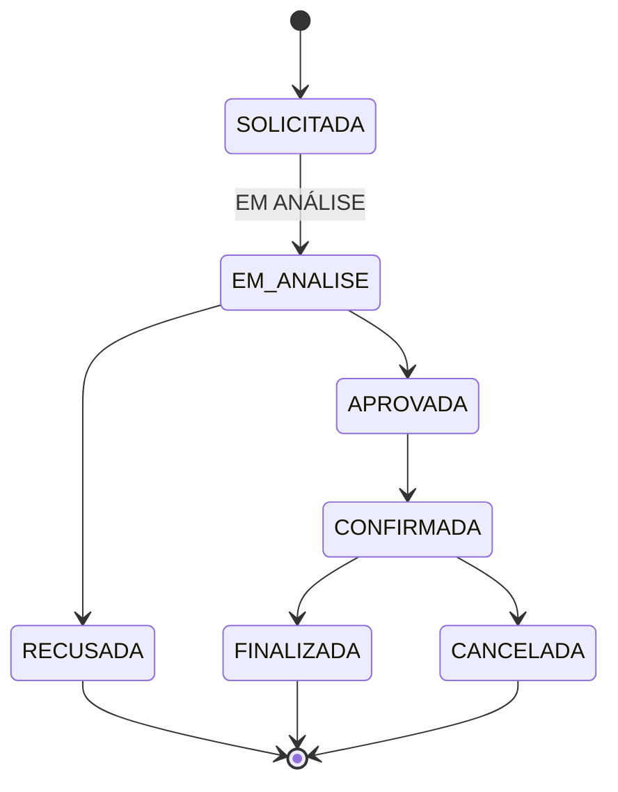
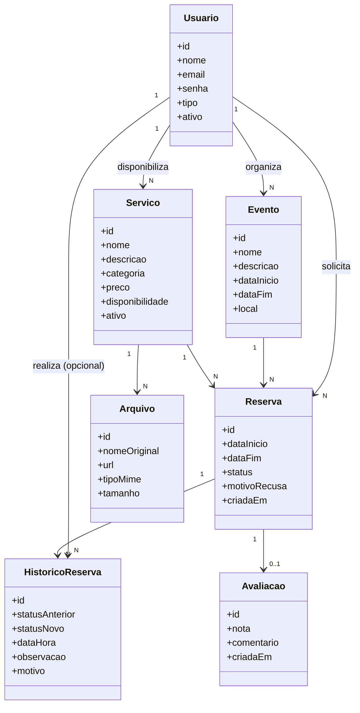
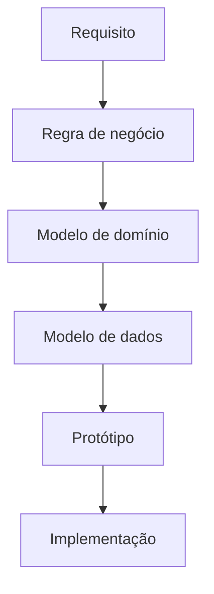

# Modelo de Domínio — EventFy

## Sumário

- [1. Visão geral](#1-visão-geral)
- [2. Entidades](#2-entidades)
- [3. Relacionamentos](#3-relacionamentos)
- [4. Estados da Reserva](#4-estados-da-reserva)
- [5. Transições válidas](#5-transições-válidas)
- [6. Diagrama conceitual](#6-diagrama-conceitual)
- [7. Rastreabilidade](#7-rastreabilidade)
- [8. Decisões e pontos pendentes](#8-decisões-e-pontos-pendentes)
- [9. Consistência com os requisitos](#9-consistência-com-os-requisitos)

---

## 1. Visão geral

O modelo de domínio representa os principais conceitos do EventFy, seus atributos, responsabilidades e relacionamentos.

O modelo foi construído a partir dos requisitos funcionais, requisitos não funcionais e regras de negócio definidos em `REQUISITOS.md`.

As principais entidades do domínio são:

- `Usuario`
- `Evento`
- `Servico`
- `Arquivo`
- `Reserva`
- `Avaliacao`
- `HistoricoReserva`

---

## 2. Entidades

### 2.1 Usuario

Representa uma pessoa cadastrada na plataforma.

Um usuário pode atuar como organizador de eventos ou como prestador/fornecedor de serviços, de acordo com seu tipo de usuário.

#### Atributos

| Atributo | Descrição |
|---|---|
| id | Identificador único do usuário |
| nome | Nome do usuário |
| email | Endereço de e-mail utilizado no cadastro e autenticação |
| senha | Credencial do usuário, armazenada de forma protegida |
| tipo | Tipo de usuário |
| ativo | Indica se o usuário está ativo |

#### Regras

- O email deve ser único.
- O usuário deve possuir um identificador único.
- O usuário deve possuir um tipo definido.
- Usuários desativados não devem realizar operações que exijam uma conta ativa.
- A senha não deve ser armazenada em texto puro.

#### Requisitos relacionados

`RF01` · `RF02` · `RF03` · `RNF01` · `RNF04`

---

### 2.2 Evento

Representa um evento criado por um organizador.

Um evento pertence a um único organizador.

#### Atributos

| Atributo | Descrição |
|---|---|
| id | Identificador único do evento |
| nome | Nome do evento |
| descricao | Descrição do evento |
| dataInicio | Data e hora de início |
| dataFim | Data e hora de término |
| local | Local de realização do evento |

#### Regras

- Um evento deve possuir um único organizador responsável.
- A data de início não pode ser posterior à data de término.
- O organizador somente pode gerenciar eventos sob sua responsabilidade.
- Alterações em eventos que possuam reservas devem respeitar as regras de negócio relacionadas às reservas.

#### Requisitos relacionados

`RF09` · `RF15` · `RN01` · `RNF06`

---

### 2.3 Servico

Representa um serviço ou estrutura disponibilizado por um prestador ou fornecedor.

#### Atributos

| Atributo | Descrição |
|---|---|
| id | Identificador único do serviço |
| nome | Nome do serviço |
| descricao | Descrição do serviço |
| categoria | Categoria do serviço |
| preco | Valor cobrado pelo serviço |
| disponibilidade | Informações relacionadas à disponibilidade |
| ativo | Indica se o serviço está disponível para novas solicitações |

#### Regras

- Um serviço deve possuir um prestador ou fornecedor responsável.
- Um serviço desativado não pode receber novas solicitações.
- A desativação de um serviço não deve eliminar seu histórico.
- O preço deve possuir valor válido.
- A disponibilidade deve ser considerada antes da confirmação de uma reserva.

#### Requisitos relacionados

`RF04` · `RF05` · `RF06` · `RF07` · `RF08` · `RN02` · `RN06`

---

### 2.4 Arquivo

Representa um arquivo associado a um serviço.

O conteúdo do arquivo deve ser armazenado em um mecanismo de armazenamento apropriado, enquanto seus metadados são mantidos pelo sistema.

#### Atributos

| Atributo | Descrição |
|---|---|
| id | Identificador único do arquivo |
| nomeOriginal | Nome original do arquivo |
| url | Referência para o arquivo armazenado |
| tipoMime | Tipo MIME do arquivo |
| tamanho | Tamanho do arquivo |

#### Regras

- Um arquivo deve estar associado a um serviço.
- A URL deve permitir localizar o arquivo armazenado.
- O sistema deve manter os metadados necessários para identificar o arquivo.

#### Requisitos relacionados

`RF04` · `RF07` · `RF08` · `RNF06`

---

### 2.5 Reserva

Representa a solicitação e o processo de contratação de um serviço para um evento.

A reserva é o principal elemento responsável por representar o fluxo de contratação do EventFy.

#### Atributos

| Atributo | Descrição |
|---|---|
| id | Identificador único da reserva |
| dataInicio | Início do período solicitado |
| dataFim | Fim do período solicitado |
| status | Estado atual da reserva |
| motivoRecusa | Motivo informado quando a reserva é recusada |
| criadaEm | Data e hora de criação da reserva |

#### Relacionamentos

Uma reserva deve estar relacionada a:

- um organizador;
- um evento;
- um serviço;
- um prestador ou fornecedor responsável pelo serviço.

#### Regras

- Uma nova reserva deve iniciar no estado `SOLICITADA`.
- O período solicitado deve ser válido.
- O serviço deve estar disponível para o período solicitado.
- Somente o responsável pelo serviço pode analisar a solicitação.
- Uma recusa exige um motivo.
- Uma reserva aprovada pode ser confirmada pelo organizador responsável.
- O cancelamento não deve apagar fisicamente a reserva.
- O histórico da reserva deve ser preservado.

#### Requisitos relacionados

`RF10` · `RF11` · `RF12` · `RF13` · `RF14` · `RF16` · `RF18` · `RN03` · `RN04` · `RN05` · `RN06` · `RN07` · `RNF02` · `RNF05` · `RNF06`

---

### 2.6 HistoricoReserva

Representa uma alteração realizada no estado de uma reserva.

Essa entidade é necessária para preservar a rastreabilidade das alterações realizadas durante o ciclo de vida da reserva.

#### Atributos

| Atributo | Descrição |
|---|---|
| id | Identificador único do registro histórico |
| statusAnterior | Estado da reserva antes da alteração |
| statusNovo | Estado da reserva após a alteração |
| dataHora | Data e hora da alteração |
| observacao | Informação complementar ou justificativa |
| motivo | Motivo da alteração quando aplicável |

#### Relacionamentos

- Um registro de histórico pertence a uma única reserva.
- Uma reserva pode possuir vários registros de histórico.
- Uma alteração pode estar associada ao usuário responsável pela operação.

#### Regras

- Toda alteração de estado deve ser registrada.
- O estado anterior deve ser preservado.
- O novo estado deve ser preservado.
- A data e hora da alteração devem ser registradas.
- O usuário responsável deve ser identificado quando a alteração for realizada por um usuário.
- O histórico não deve ser apagado quando a reserva for cancelada.

#### Requisitos relacionados

`RF18` · `RN07` · `RNF05`

---

### 2.7 Avaliacao

Representa uma avaliação realizada pelo organizador após a conclusão de uma contratação.

#### Atributos

| Atributo | Descrição |
|---|---|
| id | Identificador único da avaliação |
| nota | Nota atribuída ao serviço |
| comentario | Comentário da avaliação |
| criadaEm | Data e hora da avaliação |

#### Regras

- A avaliação deve estar relacionada a uma reserva.
- A avaliação somente pode ser realizada pelo organizador responsável pela reserva.
- A reserva deve estar no estado `FINALIZADA`.
- Uma avaliação não deve estar associada a uma contratação inexistente.

#### Requisitos relacionados

`RF17` · `RNF06`

---

## 3. Relacionamentos

| # | Relação | Cardinalidade | Observação |
|---|---|---|---|
| 3.1 | Usuario → Evento | 1 : N | Um organizador pode possuir vários eventos; cada evento tem exatamente um organizador responsável. |
| 3.2 | Usuario → Servico | 1 : N | Um prestador/fornecedor pode disponibilizar vários serviços; cada serviço tem exatamente um responsável. |
| 3.3 | Servico → Arquivo | 1 : N | Um serviço pode possuir vários arquivos; cada arquivo pertence a um único serviço. |
| 3.4 | Evento → Reserva | 1 : N | Um evento pode possuir várias reservas; cada reserva pertence a um único evento. |
| 3.5 | Servico → Reserva | 1 : N | Um serviço pode receber várias solicitações ao longo do tempo; cada reserva refere-se a um único serviço. |
| 3.6 | Usuario (organizador) → Reserva | 1 : N | Um organizador pode possuir várias reservas; cada reserva tem um único organizador responsável. O prestador/fornecedor também se associa indiretamente às reservas por meio dos serviços que disponibiliza. |
| 3.7 | Reserva → HistoricoReserva | 1 : N | Uma reserva pode possuir vários registros de histórico; cada registro pertence a uma única reserva. |
| 3.8 | Usuario → HistoricoReserva | 1 : N | Um usuário pode realizar várias alterações de estado; a associação é opcional para alterações automáticas do sistema. |
| 3.9 | Reserva → Avaliacao | 1 : 0..1 | Uma reserva pode possuir uma avaliação, que só existe após a conclusão da contratação. |

---

## 4. Estados da Reserva

A reserva possui um ciclo de vida definido:

### 4.1 Estados

| Estado | Descrição |
|---|---|
| `SOLICITADA` | Estado inicial da reserva após sua criação pelo organizador. |
| `EM ANÁLISE` | Indica que o prestador ou fornecedor responsável iniciou a análise da solicitação. |
| `APROVADA` | Indica que o prestador ou fornecedor aceitou a solicitação. |
| `RECUSADA` | Indica que o prestador ou fornecedor recusou a solicitação. A reserva deve possuir um motivo de recusa. |
| `CONFIRMADA` | Indica que o organizador confirmou uma reserva que havia sido aprovada. |
| `CANCELADA` | Indica que uma reserva confirmada foi cancelada de acordo com as regras de negócio. |
| `FINALIZADA` | Indica que a contratação foi concluída. |

---

## 5. Transições válidas

| Estado atual | Próximo estado | Responsável |
|---|---|---|
| SOLICITADA | EM ANÁLISE | Prestador/Fornecedor |
| EM ANÁLISE | APROVADA | Prestador/Fornecedor |
| EM ANÁLISE | RECUSADA | Prestador/Fornecedor |
| APROVADA | CONFIRMADA | Organizador |
| CONFIRMADA | FINALIZADA | Sistema/fluxo definido pelo projeto |
| CONFIRMADA | CANCELADA | Usuário autorizado |

Nenhuma outra transição deverá ser permitida sem alteração explícita das regras de negócio.

---

## 6. Diagrama conceitual

---

## 7. Rastreabilidade

| Elemento do domínio | Requisitos relacionados |
|---|---|
| Usuario | RF01, RF02, RF03, RNF01, RNF04 |
| Evento | RF09, RF15, RN01, RNF06 |
| Servico | RF04, RF05, RF06, RF07, RF08, RN02, RN06 |
| Arquivo | RF04, RF07, RF08, RNF06 |
| Reserva | RF10, RF11, RF12, RF13, RF14, RF16, RF18, RN03, RN04, RN05, RN06, RN07, RNF02, RNF05, RNF06 |
| HistoricoReserva | RF18, RN07, RNF05 |
| Avaliacao | RF17, RNF06 |

---

## 8. Decisões e pontos pendentes

Os seguintes pontos ainda dependem de decisão da equipe e não devem ser considerados definitivamente implementados enquanto não forem especificados:

- Tipos definitivos de usuário e suas permissões.
- Representação detalhada da disponibilidade de serviços.
- Regras específicas para cancelamento.
- Existência e permissões do perfil administrador.
- Formato e conteúdo da avaliação.
- Forma definitiva de armazenamento do histórico da reserva.
- Regras para alteração de eventos que possuam reservas.
- Regras para alteração de serviços que possuam reservas.

Esses pontos deverão ser definidos em `REQUISITOS.md` antes de serem utilizados para alterar o modelo de dados ou a implementação.

---

## 9. Consistência com os requisitos

O modelo de domínio deverá ser atualizado sempre que houver alteração nos requisitos.

Uma alteração em um requisito que modifique uma entidade, um atributo, uma relação, uma cardinalidade, uma regra de negócio, um estado ou uma transição deverá ser refletida neste documento e nos demais artefatos dependentes.

A cadeia de rastreabilidade esperada é:

